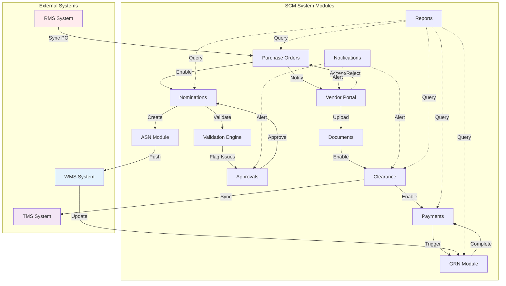

# Purchase Order End-to-End Flow

## R&B Supply Chain Management System

---

## Complete PO Lifecycle Flow Diagram

```mermaid
graph TB
    Start([PO Created in RMS]) --> Sync[RMS Sync API]

    Sync --> |POST /api/rms/sync| ValidateSync{Validate PO Data}
    ValidateSync --> |Invalid| SyncFail[Sync Failed]
    ValidateSync --> |Valid| CreatePO[Create PO in SCM]

    SyncFail --> NotifyAdmin[Notify Admin]
    NotifyAdmin --> RetrySync[Manual Retry]
    RetrySync --> Sync

    CreatePO --> AuditLog[Create Sync Audit Log]
    AuditLog --> NotifyVendor[Email Vendor with Login Link]
    NotifyVendor --> POPending[PO Status: PENDING_ACCEPTANCE]

    POPending --> VendorLogin[Vendor Logs In]
    VendorLogin --> |GET /api/vendor/dashboard| ViewPO[View PO Details]
    ViewPO --> VendorAction{Vendor Action}

    VendorAction --> |Accept| AcceptPO[POST /api/vendor/pos/:poId/action]
    VendorAction --> |Reject| RejectPO[POST /api/vendor/pos/:poId/action]
    VendorAction --> |Request Modification| ModifyPO[POST /api/vendor/pos/:poId/action]

    RejectPO --> PORejected[PO Status: REJECTED]
    PORejected --> NotifyBuyer1[Notify Buyer]
    NotifyBuyer1 --> End1([End - PO Rejected])

    ModifyPO --> POModRequest[PO Status: MODIFICATION_REQUESTED]
    POModRequest --> NotifyBuyer2[Notify Buyer]
    NotifyBuyer2 --> BuyerReview{Buyer Reviews}
    BuyerReview --> |Approve Changes| UpdateRMS[Update in RMS]
    BuyerReview --> |Reject Changes| RejectMod[Reject Modification]
    UpdateRMS --> Sync
    RejectMod --> POPending

    AcceptPO --> POAccepted[PO Status: ACCEPTED]
    POAccepted --> EnableNomination[Enable Nomination Flow]
    EnableNomination --> DownloadDocs[Vendor Downloads Barcodes/Labels]

    DownloadDocs --> CreateNom[POST /api/nominations]
    CreateNom --> SelectPOs{Nomination Type}

    SelectPOs --> |PO-Based| AutoPop[POST /api/nominations/auto-populate]
    SelectPOs --> |Item-Wise| ManualEntry[Manual Item Entry]

    AutoPop --> PopulateFields[Auto-populate from PO Data]
    ManualEntry --> PopulateFields

    PopulateFields --> EnterInvoice[Enter Invoice Quantities & Costs]
    EnterInvoice --> RunValidation[Validation Engine Runs]

    RunValidation --> QtyValidation{Quantity Validation}
    QtyValidation --> |Exact Match| NoColor[Status: NONE - Green]
    QtyValidation --> |Within 3%| YellowStatus[Status: YELLOW - Warning]
    QtyValidation --> |Exceeds 3%| RedStatus[Status: RED - Failed]

    NoColor --> CostValidation{Cost Validation}
    YellowStatus --> CostValidation
    RedStatus --> CostValidation

    CostValidation --> |Match| ValidationPass[Validation: PASSED]
    CostValidation --> |Mismatch| ValidationFail[Validation: FAILED]

    ValidationPass --> SelectRouting{Select Routing}
    ValidationFail --> FlagApproval[Flag for Approval]

    FlagApproval --> CreateApproval[Create Approval Record]
    CreateApproval --> NotifyApprover[Notify Authorized Approver]
    NotifyApprover --> ApproverReview{Approver Action}

    ApproverReview --> |Approve| ApproveNom[POST /api/approvals/:id/approve]
    ApproverReview --> |Reject| RejectNom[POST /api/approvals/:id/reject]
    ApproverReview --> |Clarify| ClarifyNom[POST /api/approvals/:id/clarify]

    RejectNom --> NomRejected[Nomination Rejected]
    NomRejected --> NotifyVendor2[Notify Vendor]
    NotifyVendor2 --> VendorRevise{Vendor Revises?}
    VendorRevise --> |Yes| CreateNom
    VendorRevise --> |No| End2([End - Nomination Rejected])

    ClarifyNom --> NotifyVendor3[Request Clarification from Vendor]
    NotifyVendor3 --> VendorRespond[Vendor Provides Clarification]
    VendorRespond --> ApproverReview

    ApproveNom --> NomApproved[Nomination: APPROVED]
    NomApproved --> SelectRouting

    SelectRouting --> |Direct Clearance| DirectRoute[Routing: DIRECT_CLEARANCE]
    SelectRouting --> |Through CFS| CFSRoute[Routing: THROUGH_CFS]

    DirectRoute --> SubmitNom[POST /api/nominations/:id/submit]
    CFSRoute --> NotifyCFS[Notify CFS Partner]
    NotifyCFS --> CFSReview[CFS Reviews Nomination]
    CFSReview --> SubmitNom

    SubmitNom --> GenerateAPP[Generate APP Reference]
    GenerateAPP --> ConfirmBooking[POST /api/nominations/:id/confirm-booking]
    ConfirmBooking --> NomConfirmed[Booking Status: CONFIRMED]

    NomConfirmed --> CreateASN[POST /api/asn]
    CreateASN --> EnterPacking[Enter Packing Details]
    EnterPacking --> PackingList{Packing Method}

    PackingList --> |Manual Entry| ManualPacking[Enter Carton Details]
    PackingList --> |Excel Upload| ExcelPacking[Upload Excel File]

    ManualPacking --> ValidateASN{Validate ASN}
    ExcelPacking --> ValidateASN

    ValidateASN --> |Value > Invoice| ASNError[Error: Exceeds Invoice Value]
    ValidateASN --> |Valid| GenerateASN[POST /api/asn/:id/generate]

    ASNError --> ReviseASN[Revise Packing Details]
    ReviseASN --> EnterPacking

    GenerateASN --> ASNGenerated[ASN Status: GENERATED]
    ASNGenerated --> DownloadPacking[Download Packing List]
    DownloadPacking --> PushWMS[POST /api/asn/:id/push-to-wms]

    PushWMS --> WMSPush{WMS Push Success?}
    WMSPush --> |Success| WMSAck[ASN Status: PUSHED_TO_WMS]
    WMSPush --> |Failed| WMSFail[ASN Status: FAILED]

    WMSFail --> LogError[Log Error & Alert Admin]
    LogError --> RetryWMS[POST /api/asn/:id/retry]
    RetryWMS --> PushWMS

    WMSAck --> UploadDocs[Upload Shipping Documents]
    UploadDocs --> DocValidation{Document Validation}

    DocValidation --> |Not PDF| DocError[Error: PDF Only]
    DocValidation --> |PDF| DocUploaded[POST /api/documents/upload]

    DocError --> UploadDocs

    DocUploaded --> LinkDocs[Link to ASN/Nomination]
    LinkDocs --> CheckMandatory{All Mandatory Docs?}

    CheckMandatory --> |No| WaitDocs[Wait for Documents]
    CheckMandatory --> |Yes| DocsComplete[Documents Complete]

    WaitDocs --> UploadDocs

    DocsComplete --> DocApproval[Compliance Manager Reviews]
    DocApproval --> DocAction{Document Action}

    DocAction --> |Approve| ApproveDocs[POST /api/documents/:id/approve]
    DocAction --> |Reject| RejectDocs[POST /api/documents/:id/reject]

    RejectDocs --> NotifyVendor4[Notify Vendor with Reason]
    NotifyVendor4 --> ReuploadDocs[Vendor Re-uploads]
    ReuploadDocs --> UploadDocs

    ApproveDocs --> DocsApproved[All Documents Approved]
    DocsApproved --> CreateClearance[POST /api/clearance]

    CreateClearance --> ClearanceCreated[Clearance Status: PENDING]
    ClearanceCreated --> RegisterTMS[POST /api/clearance/:id/tms/register]
    RegisterTMS --> EnterShipment[Enter Shipment Details]

    EnterShipment --> ShipmentDetails[BL#, Container#, Vessel, Voyage]
    ShipmentDetails --> EnterDates[Enter ETD/ETA/ATD/ATA]
    EnterDates --> ValidateDates{Validate Date Sequence}

    ValidateDates --> |ATA before ATD| DateError[Error: Invalid Date Sequence]
    ValidateDates --> |Valid| DatesValid[Dates Validated]

    DateError --> EnterDates

    DatesValid --> ReceiveDocs[Documents Received at Port]
    ReceiveDocs --> SubmitCustoms[Submit to Customs]
    SubmitCustoms --> ImportDecl[POST /api/clearance/:id/tms/import-declaration]

    ImportDecl --> ClearanceReview[Clearance Status: UNDER_REVIEW]
    ClearanceReview --> CustomsProcess{Customs Processing}

    CustomsProcess --> |Hold| OnHold[Clearance Status: ON_HOLD]
    CustomsProcess --> |Clear| Cleared[Clearance Status: CLEARED]

    OnHold --> ResolveIssue[Resolve Customs Issue]
    ResolveIssue --> CustomsProcess

    Cleared --> EnterExpenses[Enter Clearance Expenses]
    EnterExpenses --> ExpenseDetails[Freight, Storage, Duty, Other]
    ExpenseDetails --> CalcTotal[Auto-calculate Total Import Expenses]
    CalcTotal --> UpdateMilestones[Update Clearance Milestones]

    UpdateMilestones --> SyncTMS[POST /api/clearance/:id/tms/sync]
    SyncTMS --> ClearanceComplete[Clearance Completed]

    ClearanceComplete --> CreatePayment[POST /api/payments]
    CreatePayment --> LinkClearance[Link Payment to Clearance]
    LinkClearance --> CheckClearance{Clearance Initiated?}

    CheckClearance --> |No| PaymentBlocked[Error: Clearance Required]
    CheckClearance --> |Yes| PaymentAllowed[Payment Allowed]

    PaymentBlocked --> WaitClearance[Wait for Clearance]
    WaitClearance --> CheckClearance

    PaymentAllowed --> AdvancePayment{Process Advance Payment?}
    AdvancePayment --> |Yes| ProcessAdvance[POST /api/payments/:id/process]
    AdvancePayment --> |No| SkipAdvance[Skip Advance]

    ProcessAdvance --> ValidateAdvance{Validate Amount}
    ValidateAdvance --> |Exceeds Invoice| PaymentError1[Error: Exceeds Invoice]
    ValidateAdvance --> |Valid| AdvancePaid[Advance Payment Processed]

    PaymentError1 --> AdvancePayment

    AdvancePaid --> PaymentPartial[Payment Status: PARTIAL_PAYMENT]
    SkipAdvance --> PaymentPartial

    PaymentPartial --> WaitShipment[Wait for Shipment Arrival]
    WaitShipment --> ShipmentArrived[Shipment Cleared & Arrived]

    ShipmentArrived --> CreateGRN[POST /api/grn]
    CreateGRN --> GRNCreated[GRN Status: PENDING]
    GRNCreated --> WaitClearanceComplete{Clearance Complete?}

    WaitClearanceComplete --> |No| GRNBlocked[Error: Clearance Required]
    WaitClearanceComplete --> |Yes| StartReceipt[GRN Status: IN_PROGRESS]

    GRNBlocked --> WaitClearance2[Wait for Clearance]
    WaitClearance2 --> WaitClearanceComplete

    StartReceipt --> ReceiveGoods[Warehouse Receives Goods]
    ReceiveGoods --> EnterReceived[PATCH /api/grn/:id/received-quantities]
    EnterReceived --> RecordQuantities[Record Received, Damaged, Shortage]

    RecordQuantities --> CheckDiscrepancy{Discrepancy Found?}
    CheckDiscrepancy --> |Yes| FlagDiscrepancy[Flag Discrepancy]
    CheckDiscrepancy --> |No| NoDiscrepancy[No Discrepancy]

    FlagDiscrepancy --> NotifyStakeholders[Notify Vendor & Buyer]
    NotifyStakeholders --> ResolveDisc[POST /api/grn/:id/resolve-discrepancy]
    ResolveDisc --> NoDiscrepancy

    NoDiscrepancy --> UploadReceipt[Upload Receipt Documents]
    UploadReceipt --> CheckReceiptDocs{Mandatory Docs?}

    CheckReceiptDocs --> |Missing| WaitReceiptDocs[Wait for Documents]
    CheckReceiptDocs --> |Complete| ReceiptDocsComplete[Receipt Docs Complete]

    WaitReceiptDocs --> UploadReceipt

    ReceiptDocsComplete --> MarkReceived[POST /api/grn/:id/mark-received]
    MarkReceived --> GRNReceived[GRN Status: RECEIVED]
    GRNReceived --> CompleteGRN[POST /api/grn/:id/complete]
    CompleteGRN --> GRNCompleted[GRN Status: COMPLETED]

    GRNCompleted --> ExportFinance[POST /api/grn/:id/export-finance]
    ExportFinance --> FinanceData[Generate Finance Matching Data]
    FinanceData --> CalcVariance[Calculate PO vs GRN Variance]
    CalcVariance --> ShareFinance[Share with Finance Team]

    ShareFinance --> CheckFinalDocs{Final Payment Docs Approved?}
    CheckFinalDocs --> |No| WaitFinalDocs[Wait for Document Approval]
    CheckFinalDocs --> |Yes| ProcessFinal[Process Final Payment]

    WaitFinalDocs --> CheckFinalDocs

    ProcessFinal --> ValidateFinal{Validate Final Payment}
    ValidateFinal --> |Exceeds Invoice| PaymentError2[Error: Exceeds Invoice]
    ValidateFinal --> |Future Date| PaymentError3[Error: Future Date]
    ValidateFinal --> |Valid| FinalPaid[Final Payment Processed]

    PaymentError2 --> ProcessFinal
    PaymentError3 --> ProcessFinal

    FinalPaid --> PaymentComplete[Payment Status: PAID_IN_FULL]
    PaymentComplete --> ShareVendor[Share Payment Copies with Vendor]
    ShareVendor --> EndTransaction[POST /api/grn/:id/end-transaction]

    EndTransaction --> TransactionEnded[Transaction Status: ENDED]
    TransactionEnded --> UpdateDashboard[Update All Dashboards]
    UpdateDashboard --> GenerateReports[Generate Reports]
    GenerateReports --> End3([End - PO Lifecycle Complete])

    style Start fill:#e1f5e1
    style End1 fill:#ffe1e1
    style End2 fill:#ffe1e1
    style End3 fill:#e1f5e1
    style POAccepted fill:#e1f5e1
    style NomApproved fill:#e1f5e1
    style WMSAck fill:#e1f5e1
    style DocsApproved fill:#e1f5e1
    style Cleared fill:#e1f5e1
    style PaymentComplete fill:#e1f5e1
    style TransactionEnded fill:#e1f5e1
    style SyncFail fill:#ffe1e1
    style PORejected fill:#ffe1e1
    style NomRejected fill:#ffe1e1
    style WMSFail fill:#ffe1e1
    style OnHold fill:#fff4e1
```



---

## Simplified High-Level Flow

```mermaid
graph LR
    A[1. RMS Sync] --> B[2. Vendor Acceptance]
    B --> C[3. Nomination]
    C --> D[4. Validation & Approval]
    D --> E[5. ASN Generation]
    E --> F[6. Document Upload]
    F --> G[7. Clearance]
    G --> H[8. Payment]
    H --> I[9. GRN]
    I --> J[10. Transaction Complete]

    style A fill:#e3f2fd
    style B fill:#f3e5f5
    style C fill:#e8f5e9
    style D fill:#fff3e0
    style E fill:#fce4ec
    style F fill:#e0f2f1
    style G fill:#f1f8e9
    style H fill:#fff9c4
    style I fill:#e1bee7
    style J fill:#c8e6c9
```



---

## Module Interaction Flow



---

## Status Transitions

### Purchase Order Status Flow

```
PENDING_ACCEPTANCE → ACCEPTED → [Nomination Enabled]
                  ↓
                  REJECTED → [End]
                  ↓
                  MODIFICATION_REQUESTED → [Back to RMS]
```

### Nomination Status Flow

```
DRAFT → SUBMITTED → CONFIRMED → IN_TRANSIT → COMPLETED
                 ↓
                 [Validation: PASSED/WARNING/FAILED]
                 ↓
                 [Approval: PENDING → APPROVED/REJECTED]
```

### ASN Status Flow

```
DRAFT → GENERATED → PUSHED_TO_WMS → RECEIVED
                 ↓
                 FAILED → [Retry]
```

### Clearance Status Flow

```
PENDING → UNDER_REVIEW → CLEARED
                      ↓
                      ON_HOLD → [Resolve] → UNDER_REVIEW
```

### Payment Status Flow

```
PENDING → PARTIAL_PAYMENT → PAID_IN_FULL
       ↓
       OVERDUE → [Resolve] → PARTIAL_PAYMENT
```

### GRN Status Flow

```
PENDING → IN_PROGRESS → RECEIVED → COMPLETED
                     ↓
                     PARTIALLY_RECEIVED → RECEIVED
                     ↓
                     DISCREPANCY → [Resolve] → RECEIVED
```

---

## Key Decision Points

### 1. Vendor PO Action

- **Accept** → Enable nomination flow
- **Reject** → End PO lifecycle, notify buyer
- **Request Modification** → Send to buyer for review

### 2. Validation Engine

- **Exact Match** → No color, proceed
- **Within 3% Tolerance** → Yellow warning, proceed
- **Exceeds 3% Tolerance** → Red flag, require approval

### 3. Approval Decision

- **Approve** → Continue to booking
- **Reject** → Return to vendor for revision
- **Request Clarification** → Vendor provides more info

### 4. Routing Selection

- **Direct Clearance** → Straight to customs
- **Through CFS** → Consolidated shipment via CFS partner

### 5. Document Validation

- **PDF Format** → Accept
- **Other Format** → Reject with error

### 6. Clearance Processing

- **Cleared** → Proceed to payment
- **On Hold** → Resolve customs issues
- **Under Review** → Wait for customs decision

### 7. Payment Processing

- **Clearance Initiated** → Allow payment
- **Documents Approved** → Allow final payment
- **Amount Valid** → Process payment

### 8. GRN Receipt

- **No Discrepancy** → Complete GRN
- **Discrepancy Found** → Flag and resolve
- **Mandatory Docs Missing** → Wait for documents

---

## Timeline Estimates

| Phase                         | Typical Duration | Critical Path       |
| ----------------------------- | ---------------- | ------------------- |
| RMS Sync to Vendor Acceptance | 1-3 days         | ✅ Yes              |
| Nomination Creation           | 1-2 days         | ✅ Yes              |
| Validation & Approval         | 1-5 days         | ✅ Yes (if flagged) |
| ASN Generation                | 1 day            | ✅ Yes              |
| Document Upload & Approval    | 2-5 days         | ✅ Yes              |
| Clearance Processing          | 5-15 days        | ✅ Yes              |
| Payment Processing            | 1-3 days         | No                  |
| GRN & Receipt                 | 1-2 days         | ✅ Yes              |
| **Total End-to-End**          | **14-36 days**   | -                   |

---

## Error Handling Points

### Critical Validation Points

1. **RMS Sync** → Data validation, retry on failure
2. **Nomination Validation** → Quantity/cost checks
3. **ASN Value** → Cannot exceed invoice value
4. **Document Format** → PDF only
5. **Date Sequence** → ATA must be after ATD
6. **Payment Amount** → Cannot exceed invoice
7. **Clearance Status** → Must be complete before GRN

### Notification Triggers

1. PO synced → Notify vendor
2. PO accepted/rejected → Notify buyer
3. Validation failed → Notify approver
4. Approval pending > 2 days → Daily reminder
5. ASN push failed → Alert admin
6. Documents rejected → Notify vendor
7. Clearance on hold → Alert clearance team
8. Payment processed → Notify vendor
9. GRN discrepancy → Notify vendor & buyer

---

## API Endpoints by Phase

### Phase 1: RMS Sync

- `POST /api/rms/sync` - Sync PO from RMS
- `GET /api/rms/sync/history` - View sync history

### Phase 2: Vendor Acceptance

- `GET /api/vendor/dashboard` - View POs
- `POST /api/vendor/pos/:poId/action` - Accept/Reject/Modify

### Phase 3: Nomination

- `POST /api/nominations` - Create nomination
- `POST /api/nominations/auto-populate` - Auto-populate from PO
- `POST /api/nominations/:id/submit` - Submit nomination

### Phase 4: Validation & Approval

- `GET /api/approvals` - View approvals
- `POST /api/approvals/:id/approve` - Approve
- `POST /api/approvals/:id/reject` - Reject

### Phase 5: ASN

- `POST /api/asn` - Create ASN
- `POST /api/asn/:id/generate` - Generate packing list
- `POST /api/asn/:id/push-to-wms` - Push to WMS

### Phase 6: Documents

- `POST /api/documents/upload` - Upload document
- `POST /api/documents/:id/approve` - Approve document

### Phase 7: Clearance

- `POST /api/clearance` - Create clearance
- `PUT /api/clearance/:id` - Update clearance
- `POST /api/clearance/:id/tms/sync` - Sync with TMS

### Phase 8: Payment

- `POST /api/payments` - Create payment
- `POST /api/payments/:id/process` - Process payment

### Phase 9: GRN

- `POST /api/grn` - Create GRN
- `POST /api/grn/:id/mark-received` - Mark as received
- `POST /api/grn/:id/end-transaction` - End transaction

---

## Conclusion

This end-to-end flow demonstrates:

- **14 major phases** from PO creation to transaction completion
- **50+ decision points** with validation and error handling
- **Integration with 3 external systems** (RMS, WMS, TMS)
- **Multiple stakeholders** (Vendor, Buyer, Approver, Clearance, Payment, Warehouse)
- **Comprehensive audit trail** at every step
- **Automated notifications** for all critical events

The system ensures **data integrity**, **compliance**, and **traceability** throughout the entire supply chain process.
