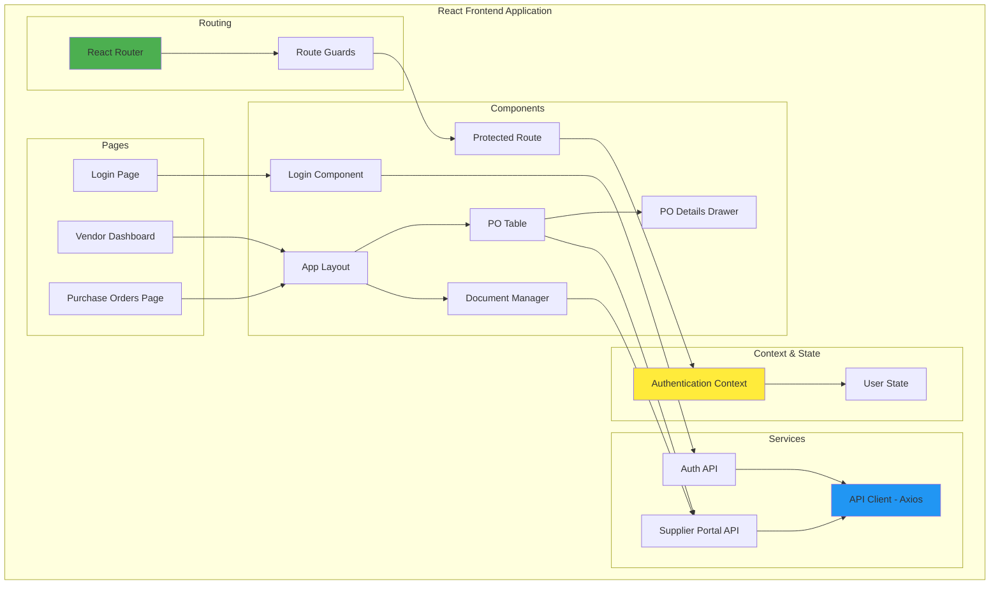
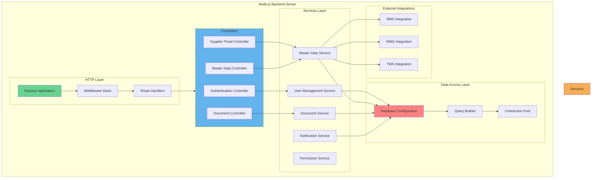
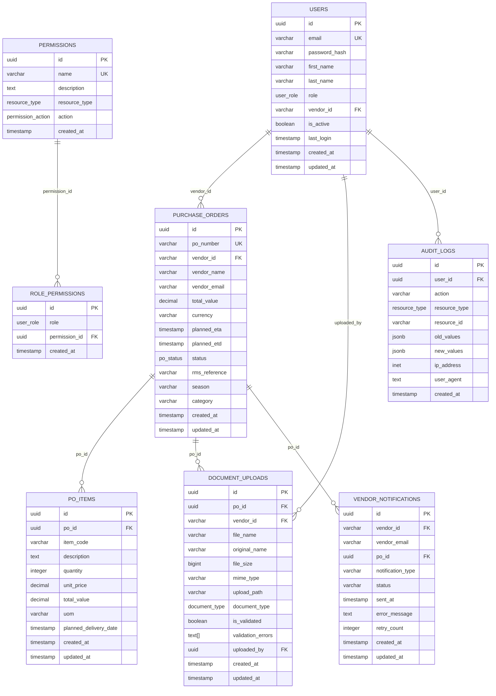
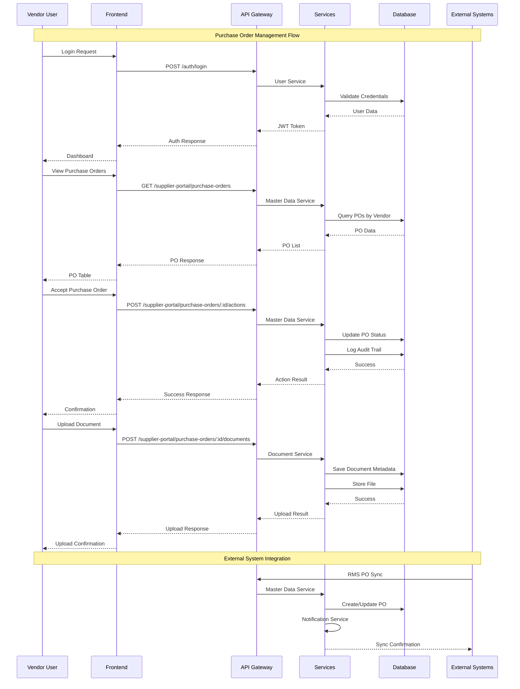
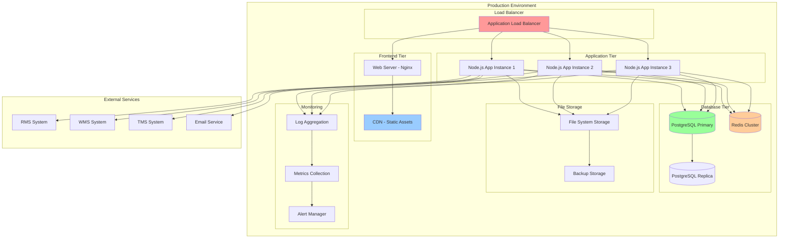

# R&B Supply Chain Management System - Architecture

## System Overview Architecture

```mermaid
graph TB
    subgraph "External Systems"
        RMS[RMS - Retail Merchandise System]
        WMS[WMS - Warehouse Management System]
        TMS[TMS - Transport Management System]
    end

    subgraph "Frontend Layer"
        subgraph "React Application"
            Login[Login Component]
            Dashboard[Vendor Dashboard]
            POList[Purchase Orders List]
            PODetails[PO Details & Actions]
            DocMgr[Document Manager]
            Layout[App Layout & Navigation]
        end

        subgraph "Frontend Services"
            AuthCtx[Auth Context]
            APIService[API Service]
            Router[React Router]
        end
    end

    subgraph "Backend Layer"
        subgraph "API Gateway"
            Express[Express.js Server]
            AuthMW[Auth Middleware]
            CORS[CORS & Security]
            RateLimit[Rate Limiting]
        end

        subgraph "Controllers"
            AuthCtrl[Auth Controller]
            SupplierCtrl[Supplier Portal Controller]
            DocCtrl[Document Controller]
            MasterDataCtrl[Master Data Controller]
            NotificationCtrl[Notification Controller]
        end

        subgraph "Services"
            UserSvc[User Service]
            MasterDataSvc[Master Data Service]
            DocSvc[Document Service]
            NotificationSvc[Notification Service]
            PermissionSvc[Permission Service]
            AuditSvc[Audit Service]
        end

        subgraph "Middleware"
            JWT[JWT Validation]
            RBAC[Role-Based Access Control]
            Audit[Audit Logging]
            ErrorHandler[Error Handler]
        end
    end

    subgraph "Data Layer"
        subgraph "PostgreSQL Database"
            UserTables[(Users & Permissions)]
            POTables[(Purchase Orders & Items)]
            DocTables[(Documents & Uploads)]
            AuditTables[(Audit Logs)]
            NotificationTables[(Notifications)]
        end

        subgraph "File Storage"
            Uploads[Document Uploads]
            Barcodes[Generated Barcodes]
        end

        subgraph "Cache Layer"
            Redis[(Redis Cache)]
        end
    end

    %% Frontend to Backend Connections
    Login --> AuthCtrl
    Dashboard --> SupplierCtrl
    POList --> SupplierCtrl
    PODetails --> SupplierCtrl
    DocMgr --> DocCtrl

    AuthCtx --> APIService
    APIService --> Express

    %% Backend Internal Connections
    Express --> AuthMW
    AuthMW --> Controllers

    AuthCtrl --> UserSvc
    SupplierCtrl --> MasterDataSvc
    DocCtrl --> DocSvc
    MasterDataCtrl --> MasterDataSvc
    NotificationCtrl --> NotificationSvc

    %% Services to Data
    UserSvc --> UserTables
    MasterDataSvc --> POTables
    DocSvc --> DocTables
    DocSvc --> Uploads
    NotificationSvc --> NotificationTables
    AuditSvc --> AuditTables

    %% External System Integrations
    RMS --> MasterDataCtrl
    MasterDataSvc --> WMS
    MasterDataSvc --> TMS

    %% Cache Connections
    UserSvc --> Redis
    MasterDataSvc --> Redis

    %% Security Flow
    JWT --> RBAC
    RBAC --> Audit
    Audit --> AuditSvc

    style RMS fill:#ff9999
    style WMS fill:#ff9999
    style TMS fill:#ff9999
    style Express fill:#99ccff
    style PostgreSQL fill:#99ff99
    style Redis fill:#ffcc99
```

## Detailed Component Architecture

### Frontend Architecture

### Backend Architecture

## Database Schema Architecture

## Security Architecture

```mermaid
graph TB
    subgraph "Security Layers"
        subgraph "Network Security"
            HTTPS[HTTPS/TLS 1.3]
            CORS[CORS Policy]
            RateLimit[Rate Limiting]
        end

        subgraph "Authentication"
            JWT[JWT Tokens]
            Login[Login Validation]
            Session[Session Management]
        end

        subgraph "Authorization"
            RBAC[Role-Based Access Control]
            Permissions[Permission Matrix]
            ResourceAccess[Resource-Level Access]
        end

        subgraph "Data Protection"
            InputValidation[Input Validation]
            SQLInjection[SQL Injection Prevention]
            XSS[XSS Protection]
            FileValidation[File Upload Validation]
        end

        subgraph "Audit & Monitoring"
            AuditTrail[Audit Trail]
            ActionLogging[Action Logging]
            SecurityEvents[Security Event Monitoring]
        end
    end

    HTTPS --> CORS
    CORS --> RateLimit
    RateLimit --> JWT

    JWT --> Login
    Login --> Session
    Session --> RBAC

    RBAC --> Permissions
    Permissions --> ResourceAccess
    ResourceAccess --> InputValidation

    InputValidation --> SQLInjection
    SQLInjection --> XSS
    XSS --> FileValidation
    FileValidation --> AuditTrail

    AuditTrail --> ActionLogging
    ActionLogging --> SecurityEvents

    style HTTPS fill:#ff6b6b
    style JWT fill:#4ecdc4
    style RBAC fill:#45b7d1
    style AuditTrail fill:#96ceb4
```

## Data Flow Architecture

## Deployment Architecture

## Key Architectural Principles

### 1. **Layered Architecture**

- **Presentation Layer**: React frontend with component-based architecture
- **API Layer**: Express.js with RESTful endpoints
- **Business Logic Layer**: Service classes with domain logic
- **Data Access Layer**: PostgreSQL with connection pooling

### 2. **Security-First Design**

- JWT-based authentication
- Role-based access control (RBAC)
- Input validation and sanitization
- Comprehensive audit logging
- File upload security

### 3. **Scalability**

- Stateless application design
- Database connection pooling
- Redis caching layer
- Horizontal scaling capability
- Load balancer ready

### 4. **Integration Architecture**

- RESTful API design
- External system webhooks
- Asynchronous processing
- Error handling and retry mechanisms
- Data synchronization patterns

### 5. **Data Management**

- Normalized database design
- Audit trail for all operations
- Document management system
- Backup and recovery strategies
- Data validation and integrity

This architecture provides a robust, scalable, and secure foundation for the R&B Supply Chain Management System, supporting the complete vendor portal workflow from authentication to document management.
