# Design Document: E-Commerce Platform

## Overview

The e-commerce platform is designed as a scalable, multi-tenant system that provides comprehensive e-commerce capabilities through a microservices architecture. The system follows API-first principles, enabling headless commerce scenarios while maintaining a cohesive admin experience. The platform supports multiple sales channels, complex product catalogs, and enterprise-grade features including advanced inventory management, promotion engines, and analytics.

The architecture emphasizes modularity, scalability, and maintainability through clear service boundaries, event-driven communication, and modern technology stack including Node.js/TypeScript, React, PostgreSQL, and Redis.

## Architecture

### High-Level Architecture

The platform follows a microservices architecture with clear service boundaries and responsibilities:

```mermaid
graph TB
    subgraph "Frontend Layer"
        AdminUI[Admin Dashboard - React]
        StorefrontUI[Storefront - React]
        MobileApp[Mobile App]
    end

    subgraph "API Gateway Layer"
        Gateway[API Gateway - Express.js]
        Auth[Authentication Service]
    end

    subgraph "Core Services"
        ProductService[Product Catalog Service]
        OrderService[Order Management Service]
        CustomerService[Customer Service]
        PaymentService[Payment Service]
        InventoryService[Inventory Service]
        CartService[Cart Service]
        PromotionService[Promotion Service]
        TaxService[Tax Service]
        ShippingService[Shipping Service]
        SearchService[Search Service]
        AnalyticsService[Analytics Service]
        ContentService[Content Management Service]
    end

    subgraph "Data Layer"
        PostgresMain[(PostgreSQL - Main DB)]
        PostgresAnalytics[(PostgreSQL - Analytics)]
        Redis[(Redis - Cache/Sessions)]
        Elasticsearch[(Elasticsearch - Search)]
        S3[(S3 - Media Storage)]
    end

    subgraph "External Services"
        PaymentGateways[Payment Gateways]
        ShippingCarriers[Shipping Carriers]
        TaxProviders[Tax Services]
        EmailService[Email Service]
    end

    subgraph "Infrastructure"
        MessageQueue[Message Queue - Redis/RabbitMQ]
        Monitoring[Monitoring & Logging]
        CDN[CDN for Static Assets]
    end

    AdminUI --> Gateway
    StorefrontUI --> Gateway
    MobileApp --> Gateway

    Gateway --> Auth
    Gateway --> ProductService
    Gateway --> OrderService
    Gateway --> CustomerService
    Gateway --> CartService

    ProductService --> PostgresMain
    ProductService --> Redis
    ProductService --> SearchService

    OrderService --> PostgresMain
    OrderService --> MessageQueue
    OrderService --> PaymentService
    OrderService --> InventoryService

    CustomerService --> PostgresMain
    CustomerService --> Redis

    PaymentService --> PaymentGateways
    PaymentService --> PostgresMain

    InventoryService --> PostgresMain
    InventoryService --> MessageQueue

    SearchService --> Elasticsearch
    AnalyticsService --> PostgresAnalytics
    ContentService --> S3

    TaxService --> TaxProviders
    ShippingService --> ShippingCarriers

    MessageQueue --> OrderService
    MessageQueue --> InventoryService
    MessageQueue --> AnalyticsService
```



### Service Architecture Patterns

**API Gateway Pattern**: Centralized entry point for all client requests, handling authentication, rate limiting, and request routing.

**Database Per Service**: Each microservice owns its data and database schema, ensuring loose coupling and independent scaling.

**Event-Driven Architecture**: Services communicate through events for eventual consistency and loose coupling, particularly for order processing workflows.

**CQRS (Command Query Responsibility Segregation)**: Separate read and write models for complex domains like analytics and reporting.

## Components and Interfaces

### Core Service Components

#### Product Catalog Service

**Responsibilities:**

- Product and variant management
- Category hierarchy management
- Product attribute and configuration management
- Product media and content coordination
- Inventory integration for availability

**Key Interfaces:**

```typescript
interface ProductService {
  // Product Management
  createProduct(
    tenantId: string,
    product: CreateProductRequest,
  ): Promise<Product>;
  updateProduct(
    tenantId: string,
    productId: string,
    updates: UpdateProductRequest,
  ): Promise<Product>;
  getProduct(tenantId: string, productId: string): Promise<Product>;
  listProducts(
    tenantId: string,
    filters: ProductFilters,
  ): Promise<PaginatedProducts>;

  // Variant Management
  createVariant(
    tenantId: string,
    productId: string,
    variant: CreateVariantRequest,
  ): Promise<ProductVariant>;
  updateVariant(
    tenantId: string,
    variantId: string,
    updates: UpdateVariantRequest,
  ): Promise<ProductVariant>;

  // Category Management
  createCategory(
    tenantId: string,
    category: CreateCategoryRequest,
  ): Promise<Category>;
  getCategoryTree(tenantId: string): Promise<CategoryTree>;

  // Search Integration
  indexProduct(product: Product): Promise<void>;
  removeFromIndex(productId: string): Promise<void>;
}
```

#### Order Management Service

**Responsibilities:**

- Order lifecycle management
- Order status tracking and transitions
- Integration with payment, inventory, and shipping services
- Order fulfillment coordination
- Order history and analytics

**Key Interfaces:**

```typescript
interface OrderService {
  // Order Creation and Management
  createOrder(tenantId: string, orderData: CreateOrderRequest): Promise<Order>;
  updateOrderStatus(
    tenantId: string,
    orderId: string,
    status: OrderStatus,
  ): Promise<Order>;
  getOrder(tenantId: string, orderId: string): Promise<Order>;
  listOrders(tenantId: string, filters: OrderFilters): Promise<PaginatedOrders>;

  // Order Processing
  processPayment(orderId: string): Promise<PaymentResult>;
  fulfillOrder(
    orderId: string,
    fulfillmentData: FulfillmentRequest,
  ): Promise<Order>;
  cancelOrder(orderId: string, reason: string): Promise<Order>;

  // Order Analytics
  getOrderMetrics(
    tenantId: string,
    dateRange: DateRange,
  ): Promise<OrderMetrics>;
}
```

#### Customer Service

**Responsibilities:**

- Customer account management
- Authentication and authorization
- Customer profile and preferences
- Customer segmentation and groups
- Customer communication preferences

**Key Interfaces:**

```typescript
interface CustomerService {
  // Account Management
  createCustomer(
    tenantId: string,
    customerData: CreateCustomerRequest,
  ): Promise<Customer>;
  updateCustomer(
    tenantId: string,
    customerId: string,
    updates: UpdateCustomerRequest,
  ): Promise<Customer>;
  getCustomer(tenantId: string, customerId: string): Promise<Customer>;

  // Authentication
  authenticateCustomer(
    tenantId: string,
    credentials: LoginCredentials,
  ): Promise<AuthResult>;
  resetPassword(tenantId: string, email: string): Promise<void>;

  // Customer Groups and Segmentation
  assignToGroup(customerId: string, groupId: string): Promise<void>;
  getCustomerSegments(tenantId: string): Promise<CustomerSegment[]>;
}
```

#### Cart Service

**Responsibilities:**

- Shopping cart state management
- Cart persistence and synchronization
- Cart calculations (subtotals, taxes, shipping)
- Cart validation and inventory checks
- Guest and authenticated cart handling

**Key Interfaces:**

```typescript
interface CartService {
  // Cart Management
  createCart(tenantId: string, customerId?: string): Promise<Cart>;
  getCart(tenantId: string, cartId: string): Promise<Cart>;
  addItem(cartId: string, item: CartItem): Promise<Cart>;
  updateItem(cartId: string, itemId: string, quantity: number): Promise<Cart>;
  removeItem(cartId: string, itemId: string): Promise<Cart>;
  clearCart(cartId: string): Promise<void>;

  // Cart Calculations
  calculateTotals(cartId: string): Promise<CartTotals>;
  applyPromotion(cartId: string, promotionCode: string): Promise<Cart>;

  // Cart Conversion
  convertToOrder(cartId: string, orderData: CheckoutData): Promise<Order>;
}
```

#### Payment Service

**Responsibilities:**

- Payment gateway integration and management
- Payment method storage and tokenization
- Transaction processing (authorize, capture, refund)
- Payment security and PCI compliance
- Multi-currency support

**Key Interfaces:**

```typescript
interface PaymentService {
  // Payment Processing
  authorizePayment(paymentRequest: PaymentAuthRequest): Promise<PaymentResult>;
  capturePayment(
    authorizationId: string,
    amount?: number,
  ): Promise<PaymentResult>;
  refundPayment(transactionId: string, amount?: number): Promise<RefundResult>;

  // Payment Methods
  savePaymentMethod(
    customerId: string,
    paymentMethod: PaymentMethodData,
  ): Promise<PaymentMethod>;
  getPaymentMethods(customerId: string): Promise<PaymentMethod[]>;
  deletePaymentMethod(paymentMethodId: string): Promise<void>;

  // Gateway Management
  processWithGateway(
    gatewayId: string,
    request: GatewayRequest,
  ): Promise<GatewayResponse>;
}
```

#### Inventory Service

**Responsibilities:**

- Real-time inventory tracking
- Stock reservation and allocation
- Multi-location inventory management
- Low stock alerts and notifications
- Inventory adjustments and auditing

**Key Interfaces:**

```typescript
interface InventoryService {
  // Inventory Tracking
  getStock(
    tenantId: string,
    productId: string,
    variantId?: string,
  ): Promise<StockLevel>;
  updateStock(
    tenantId: string,
    productId: string,
    adjustment: StockAdjustment,
  ): Promise<StockLevel>;

  // Reservation Management
  reserveStock(
    reservationRequest: StockReservationRequest,
  ): Promise<Reservation>;
  releaseReservation(reservationId: string): Promise<void>;
  confirmReservation(reservationId: string): Promise<void>;

  // Multi-location Support
  getStockByLocation(
    tenantId: string,
    locationId: string,
  ): Promise<LocationStock[]>;
  transferStock(transferRequest: StockTransferRequest): Promise<void>;

  // Alerts and Monitoring
  setLowStockThreshold(productId: string, threshold: number): Promise<void>;
  getLowStockItems(tenantId: string): Promise<LowStockItem[]>;
}
```

### Data Models

#### Core Entity Models

**Product Model:**

```typescript
interface Product {
  id: string;
  tenantId: string;
  name: string;
  description: string;
  slug: string;
  sku: string;
  status: ProductStatus;
  type: ProductType;
  categories: string[];
  attributes: ProductAttribute[];
  variants: ProductVariant[];
  media: MediaItem[];
  seo: SEOData;
  pricing: PricingData;
  createdAt: Date;
  updatedAt: Date;
}

interface ProductVariant {
  id: string;
  productId: string;
  name: string;
  sku: string;
  attributes: VariantAttribute[];
  pricing: PricingData;
  inventory: InventoryData;
  media: MediaItem[];
  status: VariantStatus;
}
```

**Order Model:**

```typescript
interface Order {
  id: string;
  tenantId: string;
  customerId: string;
  orderNumber: string;
  status: OrderStatus;
  items: OrderItem[];
  totals: OrderTotals;
  shipping: ShippingInfo;
  billing: BillingInfo;
  payment: PaymentInfo;
  fulfillment: FulfillmentInfo;
  timeline: OrderEvent[];
  createdAt: Date;
  updatedAt: Date;
}

interface OrderItem {
  id: string;
  productId: string;
  variantId?: string;
  name: string;
  sku: string;
  quantity: number;
  unitPrice: number;
  totalPrice: number;
  attributes: ItemAttribute[];
}
```

**Customer Model:**

```typescript
interface Customer {
  id: string;
  tenantId: string;
  email: string;
  firstName: string;
  lastName: string;
  phone?: string;
  dateOfBirth?: Date;
  status: CustomerStatus;
  groups: string[];
  addresses: Address[];
  preferences: CustomerPreferences;
  metadata: Record<string, any>;
  createdAt: Date;
  updatedAt: Date;
}
```

#### Database Schema Design

**Multi-tenancy Strategy:**

- Row-level security with tenant_id column in all tables
- Shared database with tenant isolation
- Tenant-specific configuration tables

**Key Tables:**

- `tenants` - Tenant configuration and settings
- `products` - Product catalog with full-text search
- `product_variants` - Product variations and options
- `orders` - Order management with status tracking
- `order_items` - Order line items with product references
- `customers` - Customer accounts and profiles
- `inventory` - Stock levels and reservations
- `carts` - Shopping cart persistence
- `payments` - Payment transactions and methods
- `promotions` - Discount rules and campaigns

**Indexing Strategy:**

- Composite indexes on (tenant_id, entity_id) for all tables
- Full-text search indexes on product names and descriptions
- Performance indexes on frequently queried fields (status, created_at)
- Unique constraints on business keys (SKU, email per tenant)

## Error Handling

### Error Classification and Response Strategy

**Client Errors (4xx):**

- `400 Bad Request` - Invalid input data or malformed requests
- `401 Unauthorized` - Authentication required or invalid credentials
- `403 Forbidden` - Insufficient permissions for requested operation
- `404 Not Found` - Requested resource does not exist
- `409 Conflict` - Resource conflict (duplicate SKU, insufficient inventory)
- `422 Unprocessable Entity` - Valid request format but business rule violations

**Server Errors (5xx):**

- `500 Internal Server Error` - Unexpected system errors
- `502 Bad Gateway` - External service integration failures
- `503 Service Unavailable` - System overload or maintenance
- `504 Gateway Timeout` - External service timeout

### Error Response Format

```typescript
interface ErrorResponse {
  error: {
    code: string;
    message: string;
    details?: Record<string, any>;
    timestamp: string;
    requestId: string;
  };
}
```

### Service-Specific Error Handling

**Payment Service Errors:**

- Payment gateway failures with retry mechanisms
- Insufficient funds handling with clear customer messaging
- PCI compliance error logging without sensitive data exposure

**Inventory Service Errors:**

- Stock reservation conflicts with automatic retry
- Inventory synchronization failures with eventual consistency
- Low stock threshold breaches with immediate notifications

**Order Service Errors:**

- Order state transition validation with rollback capabilities
- Fulfillment service integration failures with manual intervention queues
- Tax calculation errors with fallback to configured rates

## Testing Strategy

### Dual Testing Approach

The testing strategy combines comprehensive unit testing for specific scenarios with property-based testing for universal correctness validation:

**Unit Testing Focus:**

- API endpoint validation with various input scenarios
- Service integration points and error conditions
- Database operations and transaction handling
- Authentication and authorization flows
- Payment processing edge cases
- Complex business logic validation

**Property-Based Testing Focus:**

- Universal properties that must hold across all valid inputs
- Data consistency and integrity properties
- Business rule enforcement across different scenarios
- API contract compliance across various request patterns

### Testing Configuration

**Property-Based Testing Setup:**

- Use `fast-check` library for TypeScript property-based testing
- Configure minimum 100 iterations per property test
- Each property test references its corresponding design document property
- Tag format: **Feature: e-commerce-platform, Property {number}: {property_text}**

**Unit Testing Framework:**

- Jest for test runner and assertions
- Supertest for API endpoint testing
- Test containers for database integration testing
- Mock external services (payment gateways, shipping carriers)

**Integration Testing:**

- End-to-end order processing workflows
- Multi-service transaction scenarios
- External service integration validation
- Performance testing under load

### Test Data Management

**Test Data Strategy:**

- Factory pattern for generating test entities
- Tenant isolation in test environments
- Realistic product catalogs for comprehensive testing
- Anonymized production data for performance testing

**Database Testing:**

- Separate test databases per service
- Transaction rollback for test isolation
- Migration testing for schema changes
- Performance testing with large datasets

## Correctness Properties

_A property is a characteristic or behavior that should hold true across all valid executions of a system—essentially, a formal statement about what the system should do. Properties serve as the bridge between human-readable specifications and machine-verifiable correctness guarantees._

### Property 1: Tenant Data Isolation

_For any_ two different tenants and any data operation, data belonging to one tenant should never be accessible to or returned in queries for another tenant
**Validates: Requirements 1.1, 1.3**

### Property 2: Tenant Provisioning Completeness

_For any_ newly created tenant, the tenant should have all required default configurations and settings immediately available after creation
**Validates: Requirements 1.2**

### Property 3: Product Data Persistence

_For any_ product creation with valid data, all provided product information (name, description, pricing, media) should be retrievable exactly as stored
**Validates: Requirements 2.1**

### Property 4: Product Variant Independence

_For any_ product with multiple variants, inventory operations and attribute changes on one variant should not affect other variants of the same product
**Validates: Requirements 2.2, 2.3**

### Property 5: Product Publishing Validation

_For any_ product missing required fields, attempting to publish should fail with appropriate validation errors, while products with complete required fields should publish successfully
**Validates: Requirements 2.7**

### Property 6: Order Creation Completeness

_For any_ valid checkout process, the resulting order should contain all purchase details including items, quantities, pricing, customer information, and payment details
**Validates: Requirements 3.1**

### Property 7: Order Status State Machine

_For any_ order, status transitions should only occur through valid state paths (pending→confirmed→processing→shipped→delivered, or any state→cancelled), and invalid transitions should be rejected
**Validates: Requirements 3.2**

### Property 8: Order Status Change Side Effects

_For any_ order status change, appropriate notifications should be sent and inventory should be updated according to the new status (e.g., shipped orders reduce available inventory)
**Validates: Requirements 3.3**

### Property 9: Order Cancellation Restoration

_For any_ cancelled order, inventory levels should be restored to pre-order quantities and refund processing should be initiated if payment was captured
**Validates: Requirements 3.5**

### Property 10: Customer Registration Security

_For any_ customer registration with valid data, the account should be created with properly encrypted credentials that cannot be retrieved in plain text
**Validates: Requirements 4.1**

### Property 11: Authentication Validation

_For any_ authentication attempt, valid credentials should result in successful authentication with session creation, while invalid credentials should fail without session creation
**Validates: Requirements 4.2, 4.3**

### Property 12: Payment Operation Support

_For any_ valid payment request, the system should support authorization, capture, and refund operations with appropriate success/failure responses
**Validates: Requirements 5.3**

### Property 13: Payment Error Handling

_For any_ payment failure scenario, the system should provide clear error messages and implement appropriate retry mechanisms without exposing sensitive data
**Validates: Requirements 5.4**

### Property 14: Inventory Tracking Accuracy

_For any_ inventory operation (addition, subtraction, reservation), stock levels should be updated accurately in real-time and reflect the correct available quantity
**Validates: Requirements 6.1, 6.2**

### Property 15: Low Stock Alert Generation

_For any_ product whose inventory falls to or below its configured threshold, a low stock alert should be generated immediately
**Validates: Requirements 6.3**

### Property 16: API Response Consistency

_For any_ valid API request, the response should be in consistent JSON format with appropriate HTTP status codes and include all required fields
**Validates: Requirements 8.2**

### Property 17: API Pagination Behavior

_For any_ API request that could return large datasets, pagination should be applied with consistent page size limits and navigation metadata
**Validates: Requirements 8.5**

### Property 18: Cart Item Storage

_For any_ product added to a cart, the cart should store the item with correct quantity, variant selection, and pricing information
**Validates: Requirements 9.1**

### Property 19: Cart Persistence

_For any_ authenticated customer's cart, the cart contents should persist across different sessions and be retrievable when the customer logs in again
**Validates: Requirements 9.2**

### Property 20: Cart Total Recalculation

_For any_ change to cart contents (add, remove, update quantity), all totals including subtotal, taxes, and shipping should be recalculated accurately
**Validates: Requirements 9.3**

### Property 21: Automatic Promotion Application

_For any_ order that meets promotion criteria, eligible promotions should be automatically applied and discounts calculated correctly
**Validates: Requirements 10.4**

### Property 22: Promotion Stacking Rules

_For any_ attempt to apply multiple promotions, incompatible promotions should be prevented from stacking according to configured business rules
**Validates: Requirements 10.5**

### Property 23: Tax Calculation Accuracy

_For any_ order with customer location and product information, taxes should be calculated correctly based on applicable rates and rules
**Validates: Requirements 11.1**

### Property 24: Tax Exemption Handling

_For any_ order containing tax-exempt items or customers, appropriate exemptions should be applied and reflected in the final tax calculation
**Validates: Requirements 11.4**

### Property 25: Search Result Relevance

_For any_ search query, returned results should include products that match the query terms in names, descriptions, or attributes, ranked by relevance
**Validates: Requirements 13.1, 13.2**

### Property 26: Faceted Search Consistency

_For any_ product catalog, faceted search filters should reflect available product attributes and return accurate filtered results
**Validates: Requirements 13.6**

### Property 27: Cross-Channel Inventory Consistency

_For any_ inventory change made through one sales channel, the updated inventory levels should be immediately reflected across all other sales channels
**Validates: Requirements 16.4**

### Property 28: Authentication Security Implementation

_For any_ user authentication, passwords should be stored using secure hashing algorithms and multi-factor authentication options should be available when configured
**Validates: Requirements 19.2**
